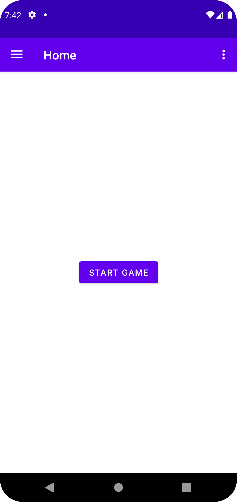
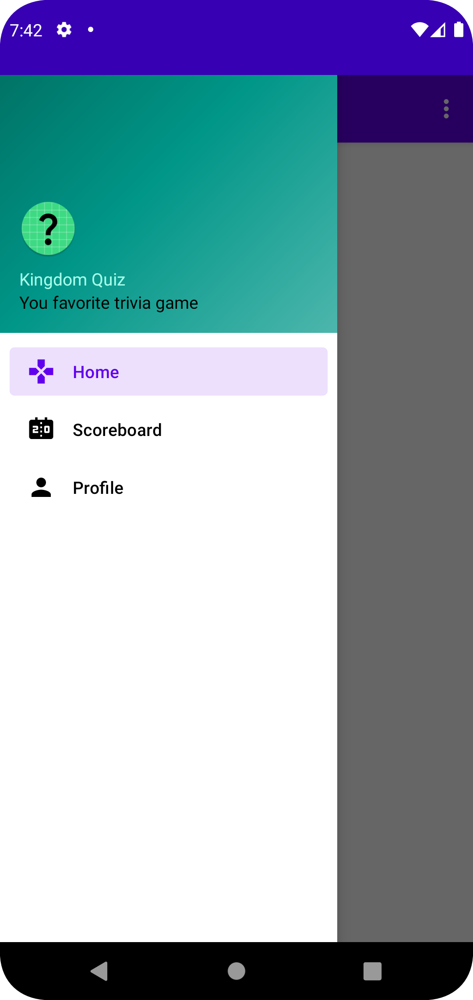
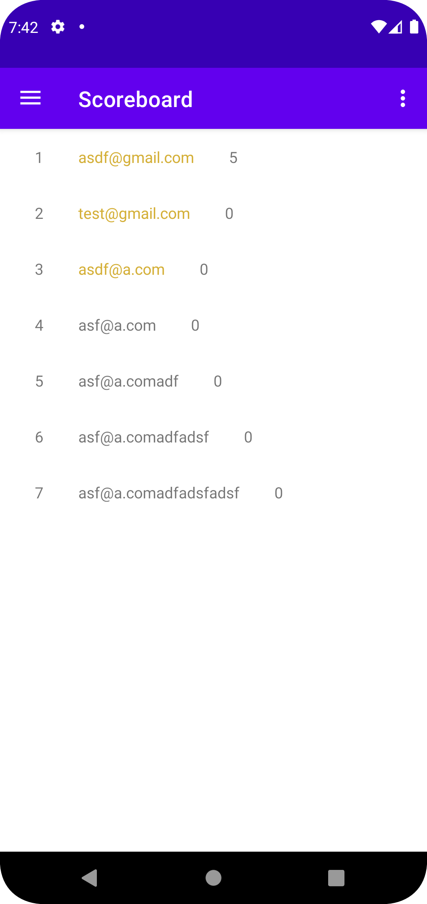
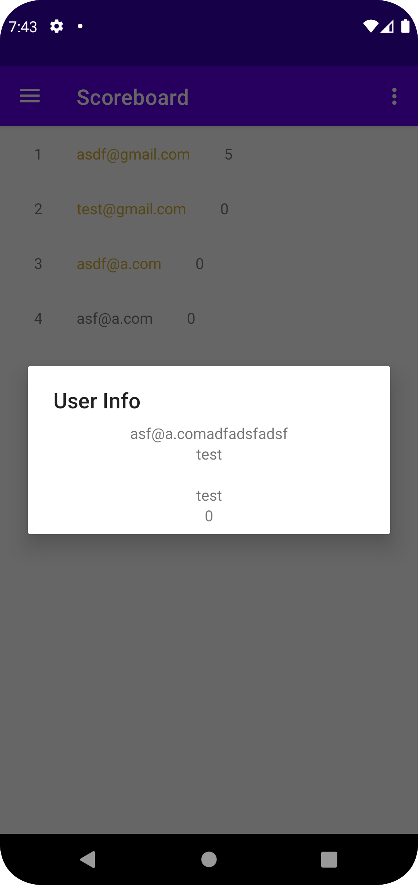
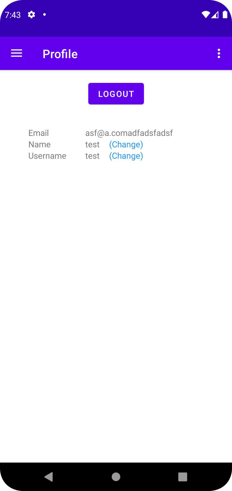
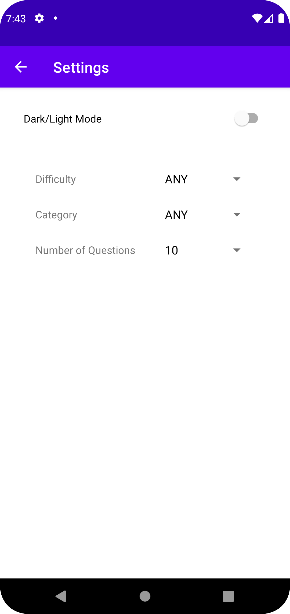
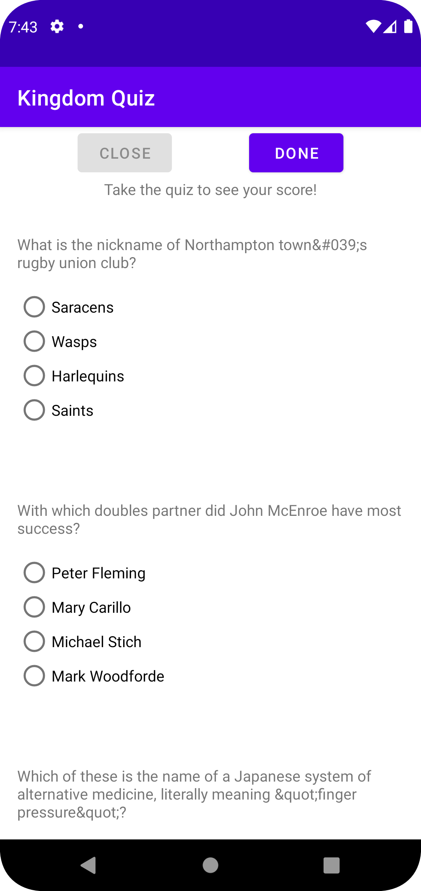
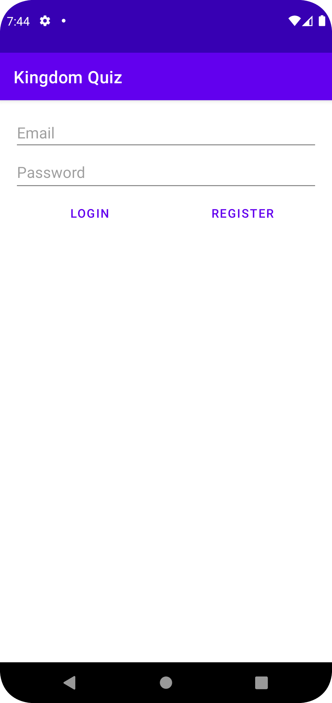

mobile-homework-2

**Mobile Programming Course Homework 2**

**Parsa Mohammadian - 98102284**

**Sara Azarnoush - 98170668**

Fall 2022

## Introduction
This app is an trivia game for Android. Players can register on it and play the game. Users can choose the category, difficulty and number of questions. 
The app also has a scoreboard that shows the top players.

## Technical Details
This app is written in Java and uses [Android Studio](https://developer.android.com/studio) as the IDE.

It uses [Gson](https://github.com/google/gson) library for parsing courses JSON file which 
are in `assets/courses` directory. [Volley](https://google.github.io/volley/) library is used for making HTTP requests. 
[Room](https://developer.android.com/training/data-storage/room) library is used for storing data in the database.

All of the questions are fetched from [Open Trivia Database](https://opentdb.com/) API. Any other data is stored locally in the database.

## Screenshots
. | . | . | .
:-:|:-:|:-:|:-:
 |  |  | 
 |  |  | 

